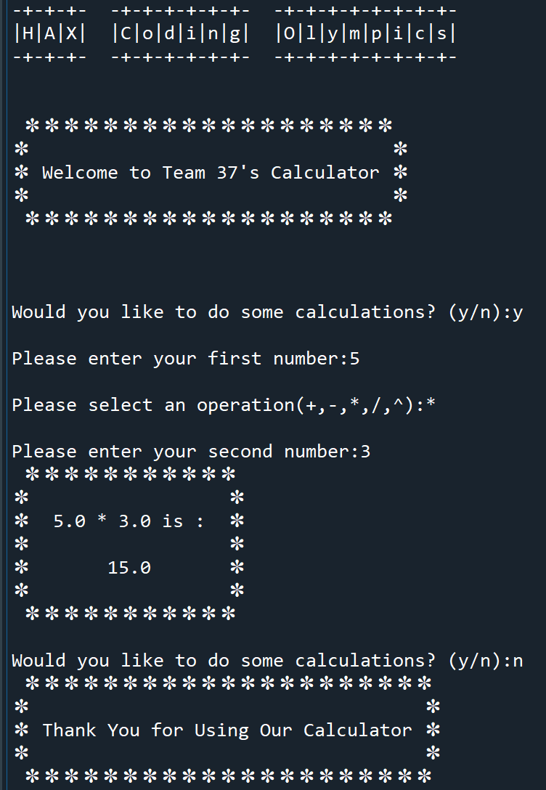
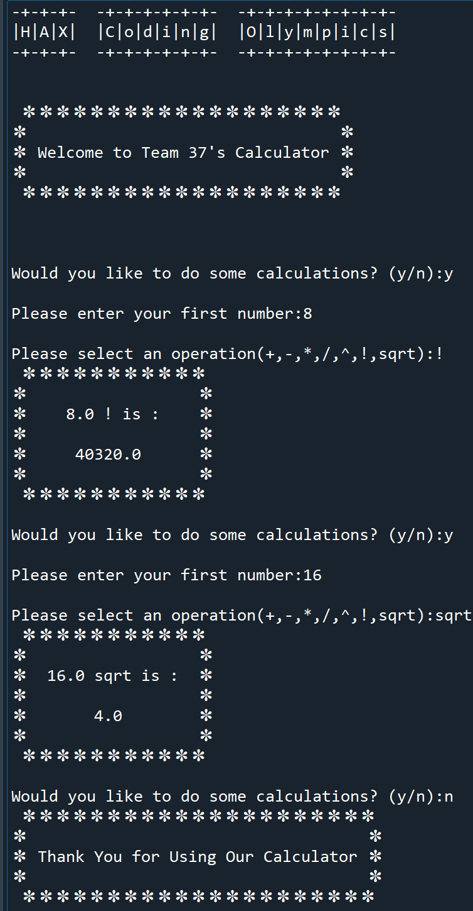
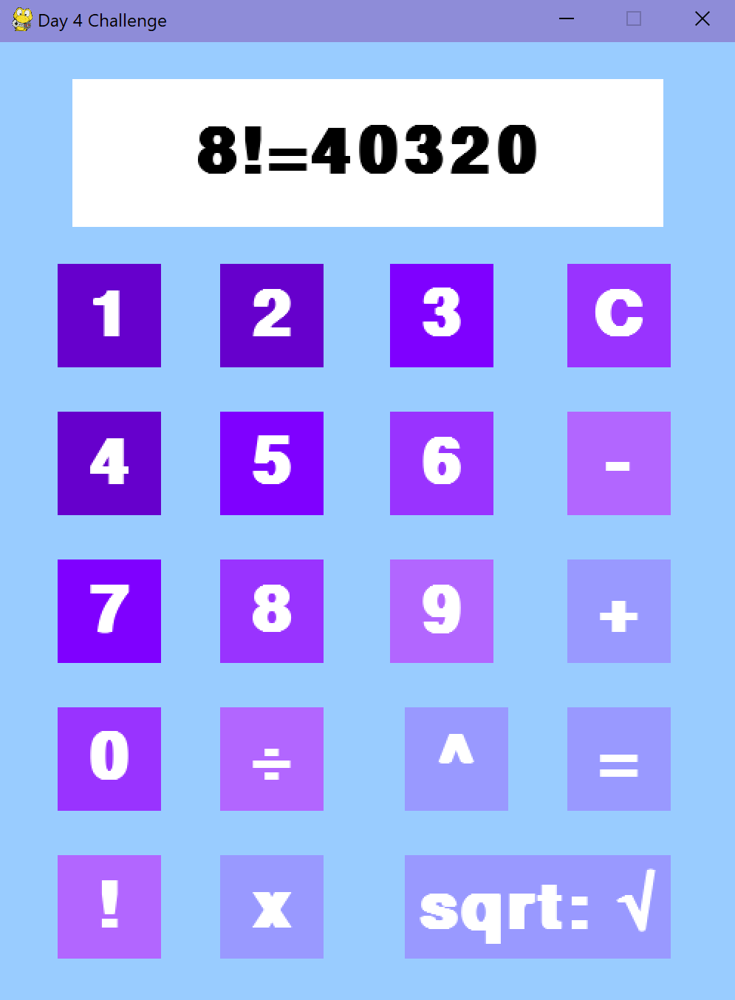

# HackAlphaX_Summer_Coding_Olympics
4 projects for 4 challenges released each day during the Hackathon

Members of team 37: Mia, Mannat, and Bhuv

### Day 1 Challenge: 

Objective: Create a text calculator that are capable of calculating +,-,*,/,^ between 2 numbers prompted from the user

Instructions: download and run 'day1_challeng.py'

output example:

### Day 2 Challenge: 

Objective: Update the day 1 calculator for more features, such as factorial and square root

Instructions: download and run 'day2_challeng.py'

output example:

### Day 3 Challenge: 

Objective: Create a button with pygame module, plays a sound when clicked, mouse movements has animated effect

Instructions: Download the 'day3_challenge' file and run the Python script (note: image and music files must be in the **same location** as the .py file)

output example:

### Day 4 Challenge:
Objective: create a calculator with pygame module

Instructions: Download the 'day4_challenge' file and run the Python script (note: 2 music files must be in the **same location** as the .py file)

output example:

